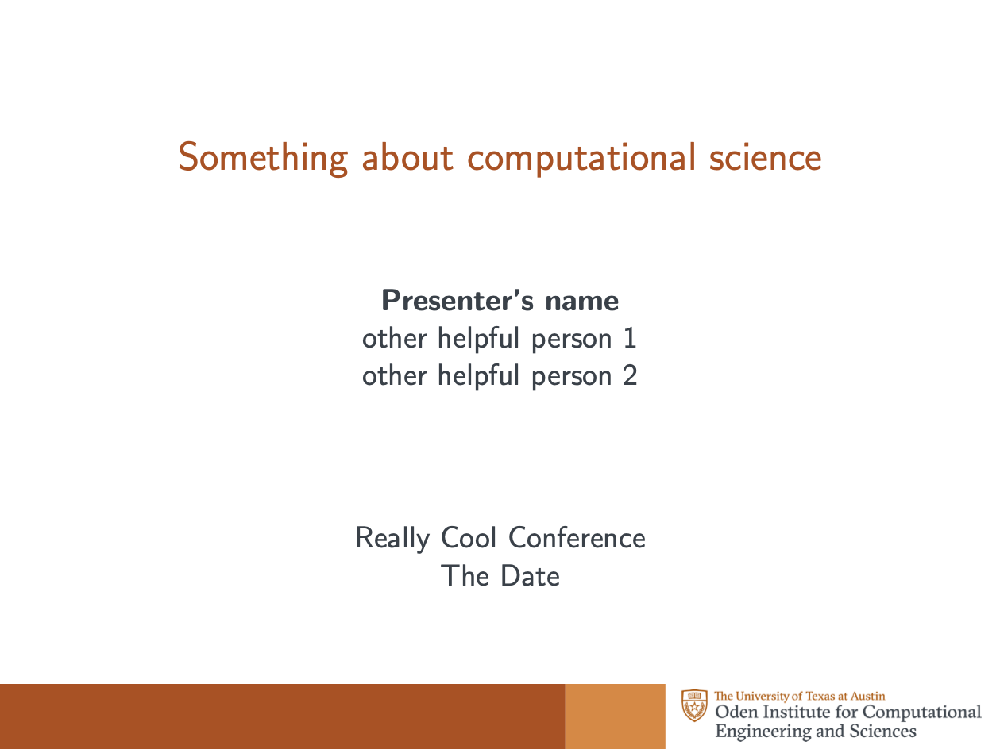
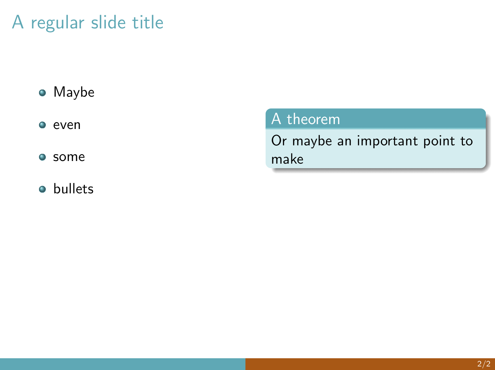

# Oden Institute Beamer Template

A template for presentations made in TeX. 
This template borrows heavily from the old ICES beamer template from Teresa Portone.

To use: copy the contents of the `template/` directory to your TeX working directory and add the line:

```
\usepackage{oden_beamer_template}
```

to the header.

See [the Oden Institute style guide](https://www.oden.utexas.edu/about/style-guide/) and 
[the University of Texas at Austin brand kit](https://brand.utexas.edu/application/brand-book-toolkit/)
for other options.

## Example




