# Oden Institute Beamer Template

A template for presentations made in TeX.
This template borrows heavily from the old ICES `beamer` template created by Teresa Portone.

See [the Oden Institute style guide](https://www.oden.utexas.edu/about/style-guide/)
and [the University of Texas at Austin brand kit](https://brand.utexas.edu/application/brand-book-toolkit/)
for other options.

## Usage

Copy the contents of the [`template/`](./template) directory (the `.cls` and `.png` files) to your TeX working directory and change the first line of the TeX file to the following:

```latex
\documentclass[10pt]{oden_beamer}
```

### Color Themes

The `oden_beamer` class implements four themes using colors from the Oden Institute style guide:

- **Light Orange** (the default): white background, charcoal text, orange highlights.
```latex
\documentclass[10pt]{oden_beamer}
````
- **Light Blue**: white background, charcoal text, blue highlights.
```latex
\documentclass[10pt, blue]{oden_beamer}
```
- **Dark Orange**: charcoal background, off-white text, orange highlights.
```latex
\documentclass[10pt, dark]{oden_beamer}
```
- **Dark Blue**: charcoal background, off-white text, blue highlights.
```latex
\documentclass[10pt, dark, blue]{oden_beamer}
```

See [Examples](#examples) below.

### Other Options

The `oden_beamer` class also loads the `beamer` class and passes all remaining options to it.
The following options may be helpful.
- `apsectratio`: default beamer slides have a 4:3 aspect ratio, but a 16:9 aspect ratio is becoming more common for presentations and conferences. The `oden_beamer` class adjusts well to the following aspect ratios.
    - `aspectratio=43` (4:3, default)
    - `aspectratio=169` (16:9, recommended)
    - `aspectratio=1610` (16:10)
- `handout`: this option suppresses animations like `\pause`, so it's good for converting your presentation to lecture notes.

## Examples

These snapshots come from [`example/example.tex`](./example/example.tex) with the header `\documentclass[10pt, aspectratio=169, handout]{oden_beamer}` (plus color theme options).

**Title Slide**
<table cellspacing="0" cellpadding="0">
<tr><td align="center" valign="top">
    Light Orange
    <p align="center">
        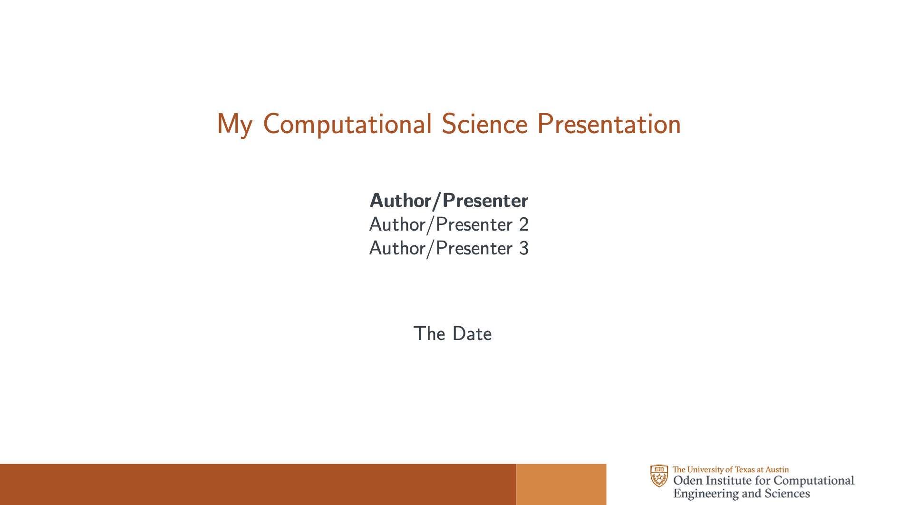
    </p>
</td><td align="center" valign="top">
    Light Blue
    <p align="center">
        
    </p>
</td></tr>
<tr><td align="center" valign="top">
    Dark Orange
    <p align="center">
        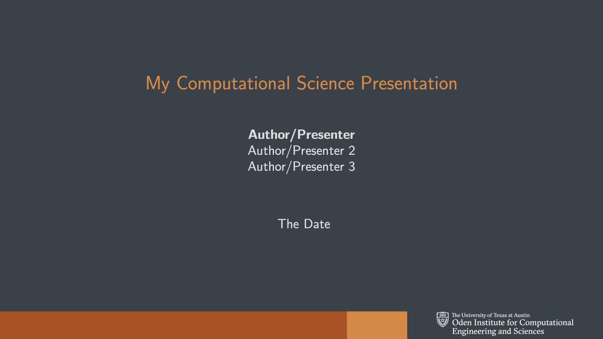
    </p>
</td><td align="center" valign="top">
    Dark Blue
    <p align="center">
        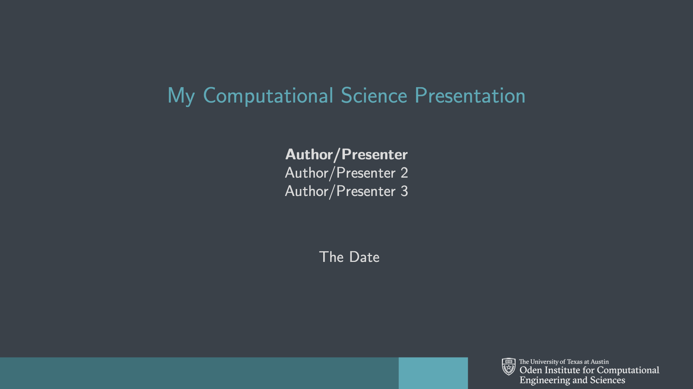
    </p>
</td></tr></table>


**Regular Slide 1**
<table cellspacing="0" cellpadding="0">
<tr><td align="center" valign="top">
    Light Orange
    <p align="center">
        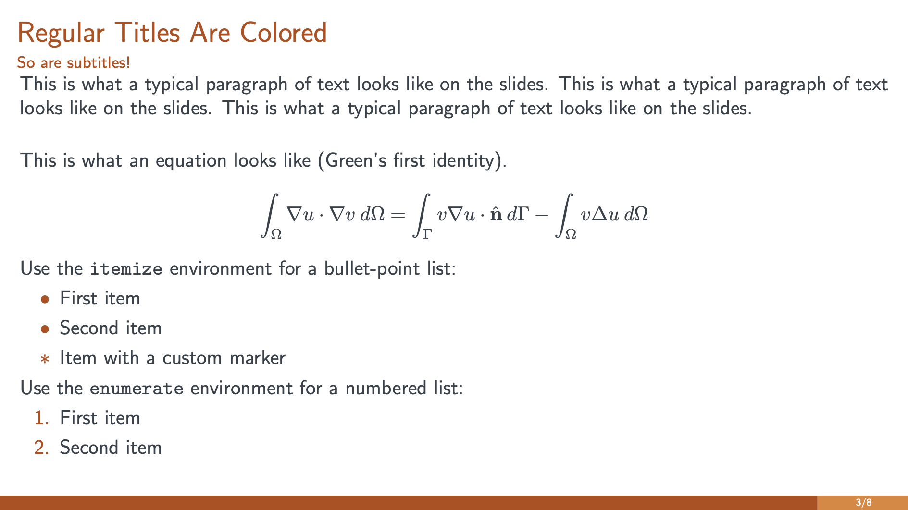
    </p>
</td><td align="center" valign="top">
    Light Blue
    <p align="center">
        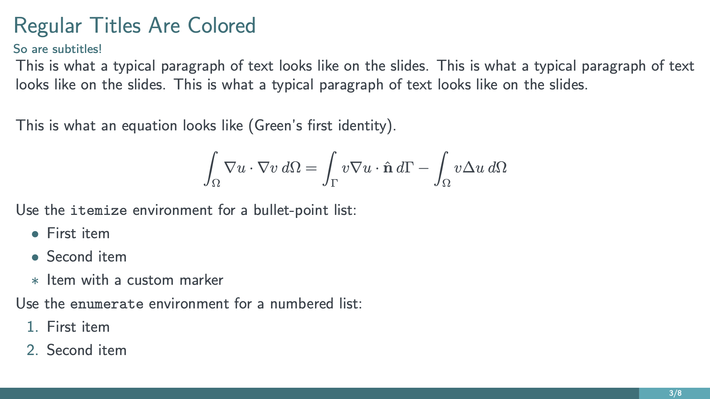
    </p>
</td></tr>
<tr><td align="center" valign="top">
    Dark Orange
    <p align="center">
        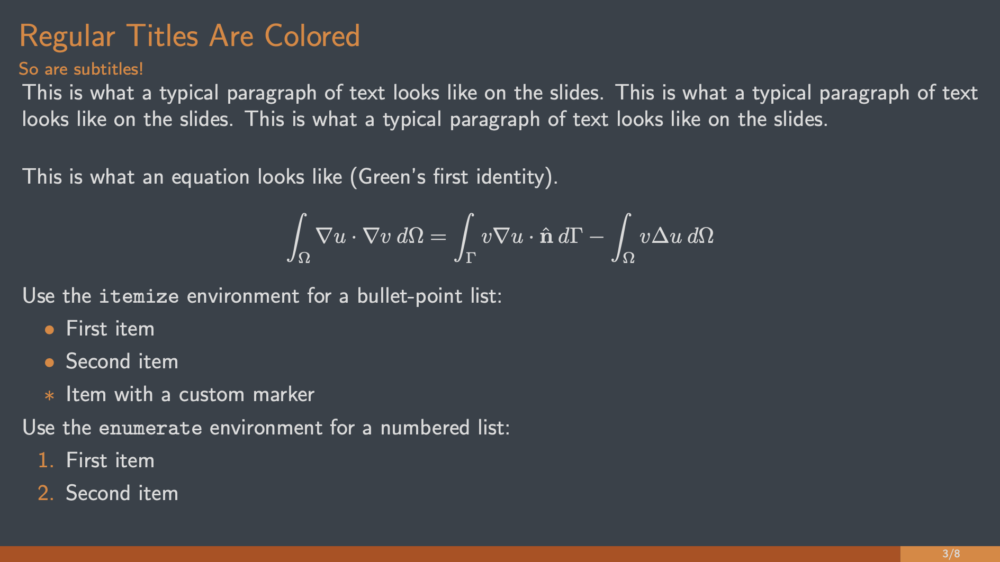
    </p>
</td><td align="center" valign="top">
    Dark Blue
    <p align="center">
        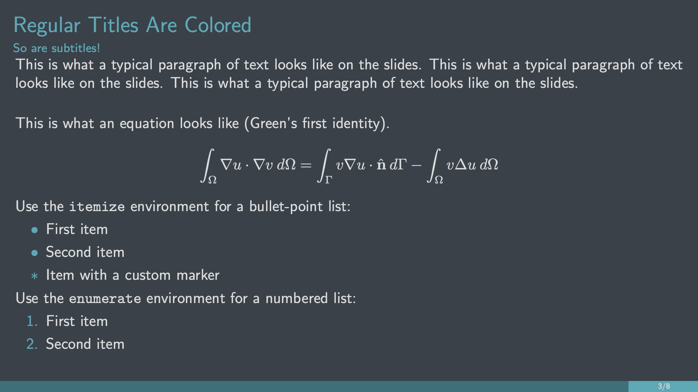
    </p>
</td></tr></table>


**Regular Slide 2**
<table cellspacing="0" celalign="center" lpadding="0">
<tr><td align="center" valign="top">
    Light Orange
    <p align="center">
        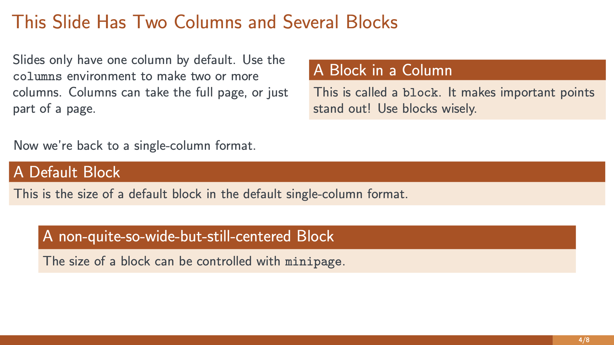
    </p>
</td><td align="center" valign="center">
    Light Blue
    <p align="center">
        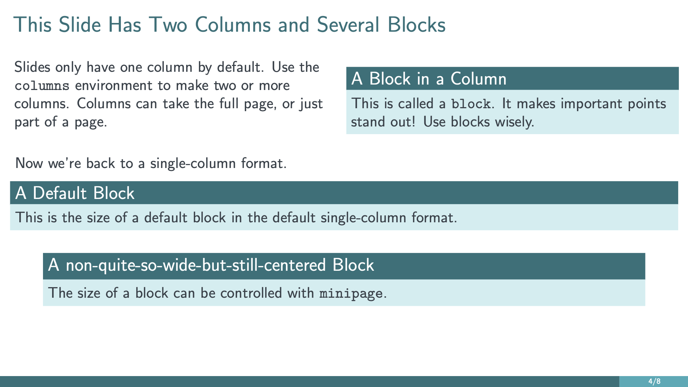
    </p>
</td></tr>
<tr><td align="center" valign="top">
    Dark Orange
    <p align="center">
        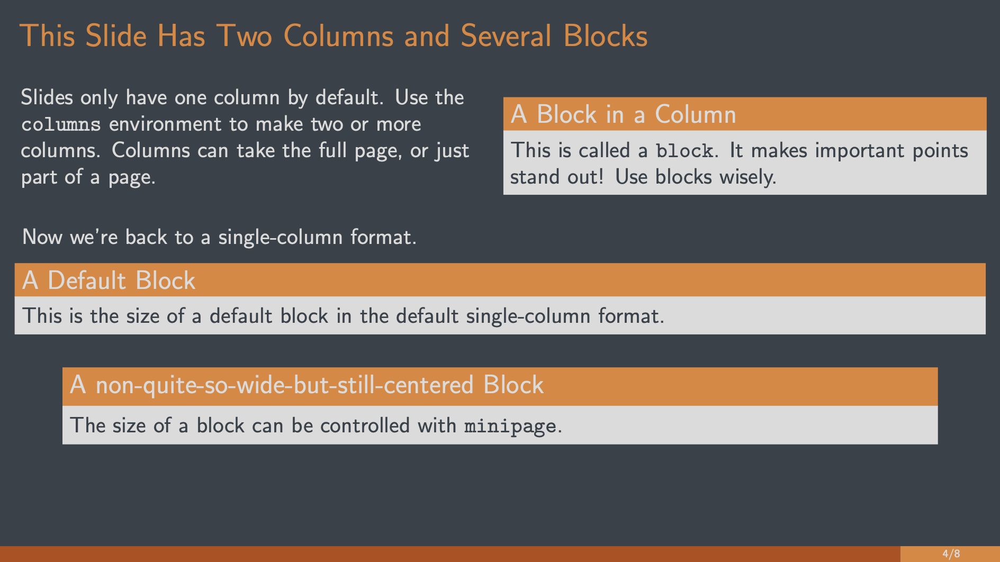
    </p>
</td><td align="center" valign="center">
    Dark Blue
    <p align="center">
        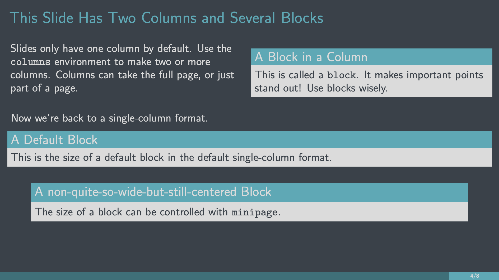
    </p>
</td></tr></table>


<!-- width="180"> -->
<!-- width="190"> -->
